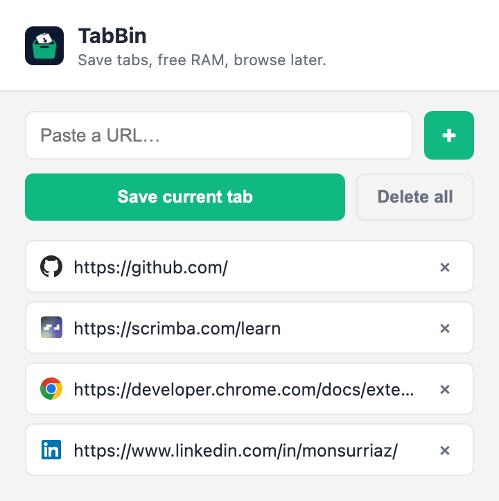

# TabBin

Save tabs, free RAM, browse later.

TabBin is a simple Chrome extension that lets you save the current tab (or any URL) as a link, close the tab to free up memory, and come back to it later from the extension popup.



## Features

- **Save current tab** — saves the active tab's URL so you can safely close the tab and reclaim memory.
- **Paste a URL** — manually save any link by pasting it into the input and clicking **+** (or pressing Enter).
- Each saved link shows its favicon and can be removed individually with the **×** button.
- **Delete all** — double-click to clear every saved link at once.
- Saved links persist locally using `localStorage`, so they're still there after closing and reopening the browser.

## Installation (load as an unpacked/custom extension)

Since this extension isn't published on the Chrome Web Store, install it locally in developer mode:

1. Download or clone this repository.
2. Open Chrome and go to `chrome://extensions`.
3. Turn on **Developer mode** (toggle in the top-right corner).
4. Click **Load unpacked**.
5. Select this project's folder (the one containing `manifest.json`).
6. The TabBin icon should now appear in your toolbar (pin it via the puzzle-piece icon if it's hidden).

To update after making changes, go back to `chrome://extensions` and click the refresh icon on the TabBin card.

## Usage

1. Click the TabBin icon in the toolbar to open the popup.
2. Click **Save current tab** to save the active tab's URL, or paste a URL into the input and click **+** (or press Enter).
3. Click any saved link to open it in a new tab.
4. Click the **×** next to a link to remove just that one, or double-click **Delete all** to clear everything.

## Project structure

```
.
├── manifest.json      # Extension manifest (Manifest V3)
├── index.html         # Popup UI
├── style.css          # Popup styles
├── script.js          # Save/restore/delete logic
├── tab-bin-icon.png   # Extension icon
└── screenshot.png     # Popup screenshot used in this README
```

## Tech

Plain HTML, CSS, and JavaScript — no build step or dependencies. Uses the `chrome.tabs` API and browser `localStorage`.
